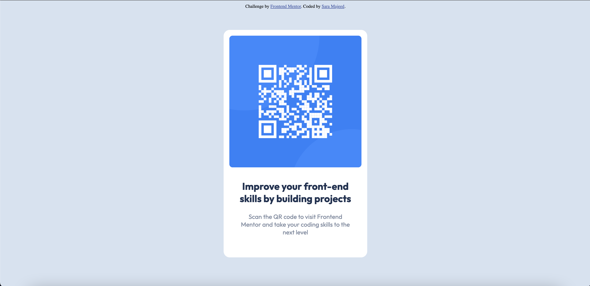

# Frontend Mentor - QR code component solution

This is a solution to the [QR code component challenge on Frontend Mentor](https://www.frontendmentor.io/challenges/qr-code-component-iux_sIO_H). Frontend Mentor challenges help you improve your coding skills by building realistic projects. 

## Table of contents

- [Overview](#overview)
  - [Screenshot](#screenshot)
  - [Links](#links)
- [My process](#my-process)
  - [Built with](#built-with)
  - [What I learned](#what-i-learned)
  - [Continued development](#continued-development)
  - [Useful resources](#useful-resources)
- [Author](#author)


## Overview

### Screenshot



### Links

- Solution URL: [https://github.com/SaraMajeed/qr-code-component](https://your-solution-url.com)
- Live Site URL: [https://saramajeed.github.io/qr-code-component/](https://your-live-site-url.com)

## My process

### Built with

- Semantic HTML5 markup
- CSS custom properties

### What I learned

In completing this project I learnt how to position an element both vertically and horizontally, something which I struggled with before. Below is a code snippet of how I accomplished this:

```css
.container {
    margin: 0;
    position: absolute;
    top: 50%;
    left: 50%;
    transform: translate(-50%, -50%);
}
```

### Continued development

In the future I would like to make this web page responsive so the layout is maintained on both tablets and mobile phones.


### Useful resources

- [freecodecamp](https://www.freecodecamp.org/news/css-vertical-align-how-to-center-a-div-text-or-an-image-example-code/) - This helped me for positioning the QR component in the center of the page, vertically and horizontally.

## Author

- Frontend Mentor - [@SaraMajeed](https://www.frontendmentor.io/profile/SaraMajeed)
